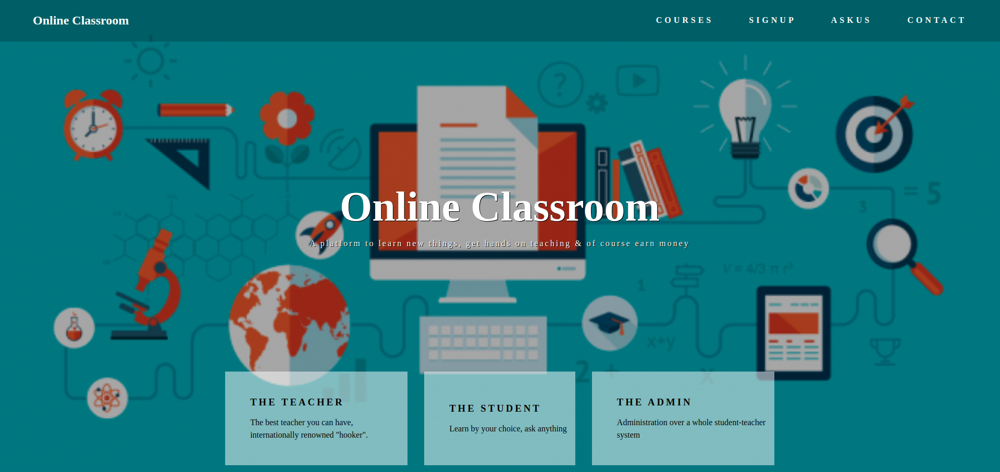

# OnlineClassroom

We propose the project Online Classroom, an approach to decrease the problems for
students and teachers relating to study. In this application, students don't need to worry
about the notes because all data is available online and students can ask a question to
teachers related to his/her course at any time.

# Links

- [Project Proposal](Project%20Proposal.pdf)
- [SRS Document](SRS.pdf)
- [Design Document](Design%20Document.pdf)

